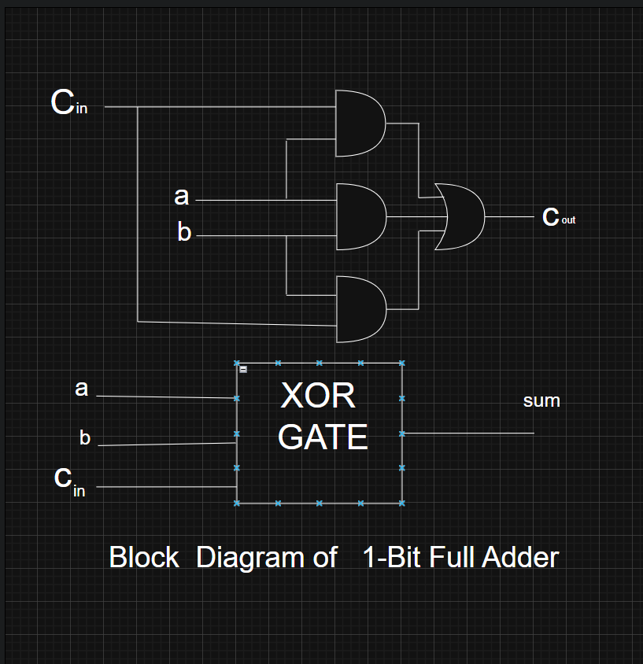
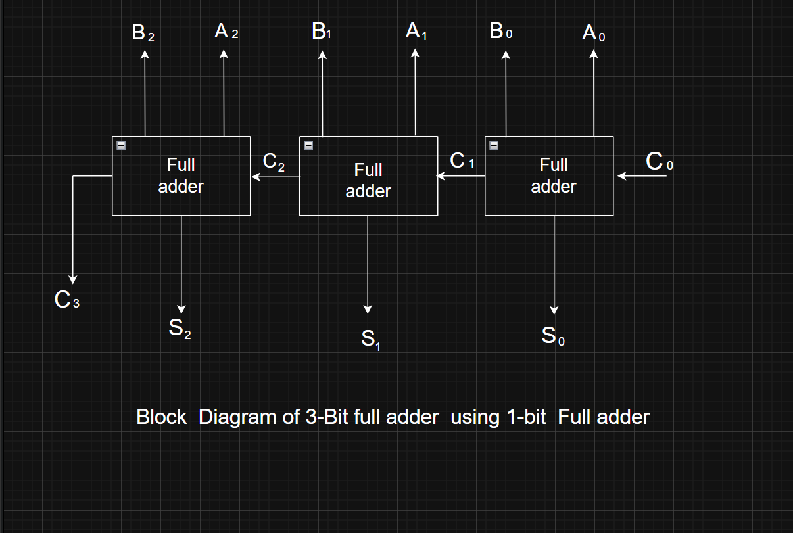
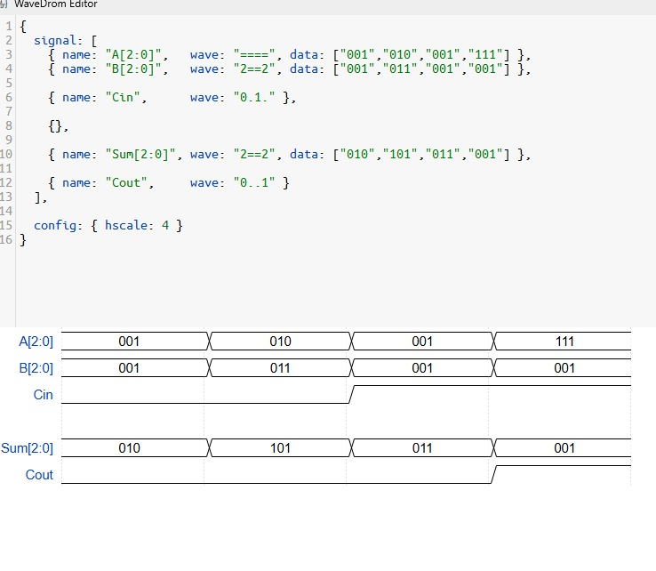

# Lab 02 Diagrams & Waveform Documentation: Ripple Carry Adder

Is directory mein **Lab 02 (Ripple Carry Adder)** ki तमाम Architectural Block Diagrams, QuestaSim Waveforms, aur WaveDrom Timing Diagrams shaamil hain. Niche har diagram ki tafseeli wazahat di gayi hai.

---

## 1. 1-Bit Full Adder Block Diagram

### Explanation:
* **Circuit Level:** Yeh diagram aik basic 1-bit full adder hardware architecture ko darshata hai.
* **Logic Operations:** 
  * **Sum Output ($Sum$):** $a \oplus b \oplus C_{in}$ (3-input XOR logic block).
  * **Carry Output ($C_{out}$):** $(a \cdot b) + (b \cdot C_{in}) + (a \cdot C_{in})$ (AND-OR logic structure).
* **Inputs/Outputs:** Inputs $a$, $b$, $C_{in}$ hain aur Outputs $Sum$, $C_{out}$ hain.

---

## 2. 1-Bit Full Adder Waveform Simulation

### Explanation:
* **Tool:** QuestaSim Testbench Simulation.
* **Functional Verification:** 
  * 1-bit Full Adder ke truth table ki verification ke liye inputs ($a1, b1, c1$) ke tamaam binary combinations (000 se 111 tak) apply kiye gaye hain.
  * Waveform se zahir hota hai ke jab single input high ho toh $Sum = 1, Carry = 0$, jab do inputs high hon toh $Sum = 0, Carry = 1$, aur jab teeno inputs high hon toh $Sum = 1, Carry = 1$ milta hai.

---

## 3. 3-Bit Ripple Carry Adder Architecture

### Explanation:
* **Cascading Logic:** Yeh block diagram 3 1-bit Full Adders ko cascade karke banaya gaya hai.
* **Carry Propagation:** First stage ka Carry Output ($C_1$) second stage ke Carry Input me chala jata hai, aur second stage ka Carry ($C_2$) third stage me ripple (propagate) hota hai.
* **Buses:** Inputs $A[2:0]$ ($A_0, A_1, A_2$) aur $B[2:0]$ ($B_0, B_1, B_2$) ko process karke final 3-bit Sum $S[2:0]$ aur Final Carry Output $C_3$ generate hota hai.

---

## 4. 3-Bit Ripple Carry Adder Simulation Waveform

### Explanation:
* **Tool:** QuestaSim Waveform Window.
* **Data Verification:**
  * Multiple 3-bit binary addition test cases verify kiye gaye hain:
    * $A=001, B=001 \implies Sum=010, Cout=0$
    * $A=010, B=011 \implies Sum=101, Cout=0$
    * $A=111, B=001, Cin=1 \implies Sum=001, Cout=1$
* Real-time multi-bit addition dynamic values ko digital bus format mein darshata hai.

---

## 5. WaveDrom Timing Diagram & Signal Protocol

### Explanation:
* **Tool:** WaveDrom Timing Editor.
* **Signal Timing & Transitions:**
  * **$A[2:0]$ & $B[2:0]$:** Bus values ke time-sliced transitions ko clear hex/binary values ($001, 010, 111$) ke sath show karta hai.
  * **$C_{in}$ & $C_{out}$:** Control inputs aur final carry propagation delays ko step-by-step visualize karta hai.
  * Complex timing analysis aur report writing ke liye digital visual representation faraham karta hai.
